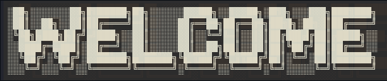
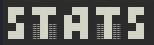

---

***Level: 21***
**/ 👾 I love the retro style 👾**
**/ 🦀 I love RUST 🦀** 

**Proverbios 24: 10-14 📖**

---

## 🚀 **Programming languages**

       

---

## 🛠️ **Herramientas y entornos**

### Editores:
   

### Sistemas Operativos:
   

  

---
## Ethical Hacking 💻

- `Networks`
- `IoT`
- `Forensics`

---

## 📂 **Proyectos Destacados**

| Proyecto | Descripción |
| -------- | ----------- |
| **[Web](https://github.com/Inf0sth/desarrolloweb_24)** | Practicas de programación web |
| **[Practicas](https://github.com/Inf0sth/School_works)** | Practicas de programación que engloban encriptación, herramientas y otros |
| **[XFCE-Custom](https://github.com/Inf0sth/xfce-Custom)** | Una guía para customizar tu linux con XFCE Desktop |

# 📊 GitHub Stats:
 
 

## 🏆 GitHub Trophies

---

